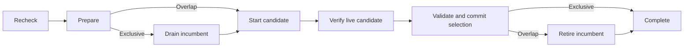

# Daemon lifecycle and replacement

Applications use this crate to coordinate a local process without implementing
another startup or upgrade state machine. The crate does not interpret application
messages. In particular, it has no MCP, compiler, cache database or exporter dependency.

## Ownership

Each service instance has two persistent lock paths: process ownership and upgrade
serialization. A process keeps ownership until its work and endpoint cleanup finish.
An updater keeps the upgrade lock through candidate verification and selection.
Lock contention is a normal outcome; I/O and permission failures are errors.
Never unlink or replace a lock file while another participant may use its inode.

`ProcessLock::try_from_file` preserves an application's secure open policy and
legacy lock path. `ProcessLock::is_held` observes without creating a lock file.
A lock is coordination, not authentication. An application chooses an OS-protected
instance directory and authenticates the socket peer separately from service UUID
validation. A UUID prevents accidental cross-service dispatch; it is not a secret.

## Readiness and request admission

A discovery record, an accepted connection and a zero process exit code are not
readiness proofs. A verifier must check a fresh response from the intended service,
process and generation against its protocol/build policy. `readiness` bounds that
verifier by an absolute deadline. Blocking probes must honor their supplied budget;
async probes are also enclosed by the timeout.

`Lifecycle` owns one irreversible admission gate. Acquire a request guard at the
application's operation boundary and keep it until the reply has been delivered or
the application has durably accepted responsibility for it. Start drain before
closing listeners; persistent connections must acquire guards too. `draining()`
wakes both existing and later observers. `drain()` waits without a deadline.
A `drain_until` timeout reports remaining guards and does not cancel their work.

Background work is a separate application obligation. Persisting an upload can
complete its request while the upload continues under the application's durable
queue. The crate does not infer that a completed handler means a flushed reply or
that a cancelled future has stopped blocking I/O.

## Replacement ordering

`replacement::run` and `run_async` execute the same transition machine while the
caller retains its upgrade lock. A driver implements individual effects; it does
not choose the order. The steps are:

| Step | Required application effect |
| --- | --- |
| Recheck | Re-read current selection and readiness under the lock; Pending waits for a compatible initializing owner, Unchanged reuses a ready owner. |
| Prepare | Validate the selected executable and capture application preparation state. Do not stop the incumbent yet. |
| Drain | Exclusive mode only: close admission and release resources the replacement needs. |
| Start | Launch exactly once, through the service manager when it owns the process. |
| Verify | Obtain a fresh candidate proof. Pending retries only this step. |
| Validate | Recheck mutable selection and prepared application state before commit. |
| Commit | Atomically publish the verified selection. Never report failure after publication succeeded. |
| Retire | Overlap mode only: close incumbent admission and initiate session retirement. Pending reports that the incumbent must remain alive. |

Overlap permits B to serve while A finishes its obligations. Exclusive replacement
releases A's mutable resources before B starts; it must not silently become overlap
when startup fails. The application chooses the mode based on its resource ownership,
not a performance preference.

Setup has a short shared deadline. Exclusive drain has an independent optional
budget; after it completes, candidate setup gets a fresh budget. Thus a two-hour
operation need not exhaust an eight-second startup allowance. A timeout never
selects an unverified candidate or automatically kills admitted work.

## Failure boundaries

- Before selection, the candidate can be discarded. A live incumbent remains
  selected. An exclusive replacement may already have stopped A: report unavailable
  or execute an explicit recovery policy; do not pretend A is still serving.
- At selection, the adapter performs one atomic publication. It must not
  await after publication or conflate a failed convenience-copy update with failed
  selection. Cancellation cannot roll back an application operation.
- After selection, B is authoritative. A failed or pending retirement cannot
  authorize killing A while it holds obligations, selecting A again, or replaying
  requests whose outcomes are unknown. `Failure::committed` identifies this boundary.
- A successful transaction is not a guarantee that B will never crash. Recovery
  requires another verified, serialized transaction with the application's policy.

Generation discovery, candidate preparation and compatibility adapters must feed
this transaction. They must not wrap it in a competing restart loop. Support for
older binaries retains their agreed lock and wire contracts until the minimum
supported client version permits removal.

## Protocol and observation boundaries

The binary lifecycle protocol uses Buffa Protobuf. Application message schemas and
request semantics remain in the consumer. Control and application operation IDs
are separate namespaces. Authenticate peers and validate identity before dispatch;
never downgrade to a legacy protocol after a failed advertised binary handshake.

Byte counters and receipt boundaries do not establish exactly-once application
execution. A relay may reconnect a transport; the application decides how to rebuild
its session and whether a particular operation can be retried.

Admission separates handshake, application and control capacity. Observation APIs
provide local counters and bounded events. Consumers decide retention and export.
No exporter, application payload, credential or user callback belongs in the common
state machine. Long writes must not prevent reading its observation snapshot.

## Platform boundary and control service

The `local` feature contains the OS-specific unsafe calls for peer credentials,
process lifetime evidence, half-close and Windows overlapped I/O. Unsafe code is
denied elsewhere. Unix listener acquisition secures the parent directory before
binding, then sets the socket to 0600 without changing the process-wide umask.
A persistent bind lock serializes stale-socket recovery and inode-checked cleanup.
Only a refused connection to an actual socket permits reclaiming that endpoint.
Permission errors, busy listeners and unrelated files do not authorize removal.

Use `RecordSlot` when a publication can race an older owner's cleanup. Every
publisher and conditional remover of that slot must use it. `publish_record` is
the lower-level atomic-write primitive for callers already holding shared ownership.
Legacy binaries do not participate in newly introduced serialization locks; retain
their original election locks and bound the supported transition in consumer tests.

`ControlService` starts in the initializing state. `mark_ready` records application
readiness; starting drain makes subsequent snapshots non-ready permanently. HEALTH
and DRAIN use a typed Protobuf payload only after HEALTH_DETAILS negotiation.
DRAIN acknowledges closed admission immediately and reports outstanding guards;
it does not wait for their completion. The listener authenticates OS peers and
reserves independent control capacity before calling `serve`.

`Generation::run_until_retired` owns refresh scheduling and session notifications.
The refresh callback reads application manifests and maps reports. Selection only
wakes observers when it advances. Session leases prevent retirement while a client
still has obligations. Persist `retry::State` against the application's candidate
fingerprint before a recovery launch, including candidates that can die after commit.

## Migration map

| Consumer code | Shared mechanism | Consumer responsibility |
| --- | --- | --- |
| Broker request lifecycle | Lifecycle | Define the MCP call/reply boundary |
| Broker generation controller | Generation, replacement, retry, Candidate | Artifact validation, route preparation, reports and legacy discovery decoding |
| Relay platform I/O | local, transport, readiness | MCP bootstrap, request correlation and replay decisions |
| Kache startup/restart | ProcessLock, replacement in exclusive mode | Build revision policy, installed service ownership and launch arguments |
| Kache control listener | ControlService, wire, admission | Cache-instance identity, readiness after initialization and endpoint advertisement |
| Kache request shutdown | Lifecycle | Persist accepted uploads and decide which background tasks may stop |

The dependency change alone is not migration completion. Consumer integration,
compatibility tests, publication and installed-artifact rollout are separate gates.

## Runnable adapters

`lifecycle_server DIRECTORY` owns a private Unix endpoint and run lock.
`blocking_health DIRECTORY` authenticates it and verifies a typed health reply;
adding `drain` closes admission and waits for the control acknowledgement.
Build both with `cargo build --all-features --examples`.

`managed_daemon DIRECTORY MANAGER [ARGS...]` demonstrates exclusive replacement
through a caller-supplied service command. The manager must already own that
exact directory and start `lifecycle_server` there. The example never installs a
service. It drains the owner, bounds the manager client, and verifies readiness
independently of the command's exit status. A timed-out manager command may have
been accepted by the manager; retry through discovery instead of assuming it
was cancelled. Production adapters also validate their executable and build policy.
