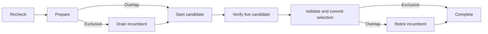

# Daemon lifecycle and replacement

Applications use this crate to coordinate a local process without implementing
another startup or upgrade state machine. The crate does not interpret application
messages. In particular, it has no MCP, compiler, cache database or exporter dependency.

## Ownership

Each service instance has two persistent lock paths: process ownership and upgrade
serialization. A process keeps ownership until its work and endpoint cleanup finish.
An updater keeps the upgrade lock through candidate verification and selection.
Lock contention is a normal outcome; I/O and permission failures are errors.
Never unlink or replace a lock file while another participant may use its inode.

`ProcessLock::try_from_file` preserves an application's secure open policy and
legacy lock path. `ProcessLock::is_held` observes without creating a lock file.
A lock is coordination, not authentication. An application chooses an OS-protected
instance directory and authenticates the socket peer separately from service UUID
validation. A UUID prevents accidental cross-service dispatch; it is not a secret.

## Client attach

Features compose as the destination for shared process code:

| Feature | Role |
| --- | --- |
| `local` | Blocking OS transport, bind, peer checks, session-end, spawn inherit guard, process exit events |
| `local-async` | Tokio listener (`windows_socket`) for a process that accepts |
| `launch` | Client-side spawn primitives on top of `local` |
| `replacement` / `readiness` | Exclusive or overlapping upgrade; bounded live probes |

A byte-pump shim enables `launch` and can call `spawn_and_wait` with a connect
probe. A cache daemon already uses `local-async`, `replacement` and
`readiness`; it can later call `launch::spawn` after setting argv, env and
stderr, and keep its health/epoch probe. It does not replace `ensure` with
connect-is-live.

The kernel bind is the election. `local::unix_socket::acquire` and
`local::windows_socket::acquire` return `Won` or `AlreadyRunning`. Clients never
unlink the endpoint. An advisory `ProcessLock` on a sibling path is layer two:
it reduces a thundering herd of client forks. If the lock and the kernel
disagree, the kernel is right.

`launch::spawn` does not change stdio. `spawn_detached` nulls stdin, stdout and
stderr for shims whose protocol owns those streams. Windows inherit of the
caller's pipes is suppressed around spawn (`StdioInheritGuard`).

On Windows, `local::windows::install_session_end_handler` arms CLOSE, LOGOFF
and SHUTDOWN so a published pipe is not left behind after logoff.

## Readiness and request admission

A discovery record, an accepted connection and a zero process exit code are not
readiness proofs. A verifier must check a fresh response from the intended service,
process and generation against its protocol/build policy. `readiness` bounds that
verifier by an absolute deadline. Blocking probes must honor their supplied budget;
async probes are also enclosed by the timeout.

A daemon started through `launch::DaemonCommand` can also say when a probe is
worth making, over the optional `readiness::channel`. It writes `ready` once
serving and may report `progress` before that. The launcher's bound is the
longest silence between messages, not a total, and the channel ending before
`ready` reports the daemon dead at once instead of at the deadline. The
signal is not a proof either: a fresh probe still follows it. On Unix the
channel's write end is the one controlled exception to closing descriptors
above stderr across the exec. On Windows the daemon opens a named pipe that
only the current user can open, so it inherits nothing, and the launcher
watches its process as well as the pipe.

A process that launches or awaits a candidate without holding the upgrade lock
uses `selection` instead of its own loop. Each round reads the published
selection before probing, so a probe that reached the incumbent is never paired
with a commit that landed while it ran. A fresh accepted probe is the only way to
report `Current`. Without one, the record decides between `Committed`, which is
authoritative and must not be rolled back, and `NotCommitted`, which may be
discarded. The commit budget covers startup. The proof budget starts when a
round reads the commit and bounds the probes after it. Polling is the default
wait between rounds; a source that can be woken replaces it without changing
these rules. A candidate's exit is such a source: `Candidate::exit_handle`
gives a `local::ProcessHandle` to wait on between probes, so a candidate that
dies before it is ready ends the wait at once instead of after the budget.

`readiness::channel::Signaled` is one: before the daemon says it
is ready, a round starts on the channel's news. A dead or silent channel ends
the wait only when that round's probe also fails, so a probe that reaches
another instance still reports it current.

`Lifecycle` owns one irreversible admission gate. Acquire a request guard at the
application's operation boundary and keep it until the reply has been delivered or
the application has durably accepted responsibility for it. Start drain before
closing listeners; persistent connections must acquire guards too. `draining()`
wakes both existing and later observers. `drain()` waits without a deadline.
A `drain_until` timeout reports remaining guards and does not cancel their work.

Background work is a separate application obligation. Persisting an upload can
complete its request while the upload continues under the application's durable
queue. The crate does not infer that a completed handler means a flushed reply or
that a cancelled future has stopped blocking I/O.

## Replacement ordering

`replacement::run` and `run_async` execute the same transition machine while the
caller retains its upgrade lock. A driver implements individual effects; it does
not choose the order. The steps are:

| Step | Required application effect |
| --- | --- |
| Recheck | Re-read current selection and readiness under the lock; Pending waits for a compatible initializing owner, Unchanged reuses a ready owner. |
| Prepare | Validate the selected executable and capture application preparation state. Do not stop the incumbent yet. |
| Drain | Exclusive mode only: close admission and release resources the replacement needs. |
| Start | Launch exactly once, through the service manager when it owns the process. |
| Verify | Obtain a fresh candidate proof. Pending retries only this step. |
| Validate | Recheck mutable selection and prepared application state before commit. |
| Commit | Atomically publish the verified selection. Never report failure after publication succeeded. |
| Retire | Overlap mode only: close incumbent admission and initiate session retirement. Pending reports that the incumbent must remain alive. |

```mermaid
flowchart LR
  R[Recheck] --> P[Prepare]
  P -->|Exclusive| D[Drain incumbent]
  P -->|Overlap| S[Start candidate]
  D --> S
  S --> V[Verify live candidate]
  V --> C[Validate and commit selection]
  C -->|Exclusive| F[Complete]
  C -->|Overlap| T[Retire incumbent]
  T --> F
```

Overlap permits B to serve while A finishes its obligations. Exclusive replacement
releases A's mutable resources before B starts; it must not silently become overlap
when startup fails. The application chooses the mode based on its resource ownership,
not a performance preference.

Setup has a short shared deadline. Exclusive drain has an independent optional
budget; after it completes, candidate setup gets a fresh budget. Thus a two-hour
operation need not exhaust an eight-second startup allowance. A timeout never
selects an unverified candidate or automatically kills admitted work.

## Failure boundaries

- Before selection, the candidate can be discarded. A live incumbent remains
  selected. An exclusive replacement may already have stopped A: report unavailable
  or execute an explicit recovery policy; do not pretend A is still serving.
- At selection, the adapter performs one atomic publication. It must not
  await after publication or conflate a failed convenience-copy update with failed
  selection. Cancellation cannot roll back an application operation.
- After selection, B is authoritative. A failed or pending retirement cannot
  authorize killing A while it holds obligations, selecting A again, or replaying
  requests whose outcomes are unknown. `Failure::committed` identifies this boundary.
- A successful transaction is not a guarantee that B will never crash. Recovery
  requires another verified, serialized transaction with the application's policy.

Generation discovery, candidate preparation and compatibility adapters must feed
this transaction. They must not wrap it in a competing restart loop. Support for
older binaries retains their agreed lock and wire contracts until the minimum
supported client version permits removal.

## Ending the requests

When a relay's client stops sending, the peer must learn that no more requests
will come, while replies to requests already sent must still arrive.
`WriterSlot::shutdown` half-closes the connection for that, and the peer answers
what it has and then closes. A Windows named pipe has no half-close:
`WindowsWriter::shutdown_write` flushes and returns `Unsupported`, and
`WriterSlot::shutdown` and `close` return that error instead of dropping it.

Without the signal the session ends from the relay side. `Outstanding` tracks
the requests sent to the peer. After the client leaves, the relay waits in
`Outstanding::wait_settled` until every one is settled, then closes the
connection. A consumer settles a request only once its whole reply, including
any record delimiter, has been flushed to the client. The wait also holds off
while failures are still being reported (`fail`) and while the session moves
between peers (`transition`). After more requests than its capacity it cannot
prove it is settled, and waits until the requests are failed or cleared. Each
request counts separately, even when a client reuses its key. A settlement
names the epoch its peer connection started in, and failing or clearing the
requests starts a new one, so a late reply from a failed peer cannot settle a
newer request.

## Protocol and observation boundaries

The binary lifecycle protocol uses Buffa Protobuf. Application message schemas and
request semantics remain in the consumer. Control and application operation IDs
are separate namespaces. Authenticate peers and validate identity before dispatch;
never downgrade to a legacy protocol after a failed advertised binary handshake.

Peer authentication is one flow on both ends of a connection.
`local::peer::evidence` reads what the OS reports for the peer: its PID and
whether it runs as this user. A `peer::Policy` turns that evidence into a
consumer-defined grant or a rejection; `SameUser`, `ExpectedProcess` and the
tiered `First` are built in, and consumers implement the trait for anything
else. `peer::authenticate` returns an `Authenticated` connection that carries
its grant into dispatch. A PID match is numeric agreement with a PID the
consumer expects, such as one its peer published in a record. A process
running as the same OS user can publish its own PID in that record, so a match
does not authenticate the record's writer or the peer's executable. The
consumer decides what a grant allows.

What the evidence describes differs by platform. Linux reports the PID and
user captured when the peer connected, listened or created the socket pair.
macOS reports the user captured then but the PID of the socket's most recent
owner. A named pipe reports the other end's PID, the client to a server and
the server to a client, and the user is then checked by opening that PID. If
the original peer has exited while another process holds its descriptor or
handle, a reused PID can make that check describe an unrelated process. On
every platform a passed or inherited descriptor carries the connection to
another process.

Byte counters and receipt boundaries do not establish exactly-once application
execution. A relay may reconnect a transport; the application decides how to rebuild
its session and whether a particular operation can be retried.

Admission separates handshake, application and control capacity. Observation APIs
provide local counters and bounded events. Consumers decide retention and export.
No exporter, application payload, credential or user callback belongs in the common
state machine. Long writes must not prevent reading its observation snapshot.

## Platform boundary and control service

The `local` feature contains the OS-specific unsafe calls for peer credentials,
process lifetime evidence, half-close and Windows overlapped I/O. Unsafe code is
denied elsewhere.

Process exit is an event, not a PID check. `ProcessHandle` holds a pidfd on
Linux, a kqueue registered for `NOTE_EXIT` on macOS and the BSDs, and a process
handle on Windows. Once opened, each refers to that process, so a later reuse
of its PID does not reach it. A child is watched from its spawn, before anything
can reap it; another process is watched from a PID taken from a live
connection's peer credentials, such as an incumbent about to retire. Open that
handle while the connection is still open: the connection does not reserve the
PID, so a handle opened after the peer has exited may name a different process.
Opening it while connected narrows that window; it does not prove the PID still
names the original peer. Where no event exists (Linux before 5.3,
a seccomp policy that refuses `pidfd_open`, FreeBSD for another user's process),
the handle falls back to checking the PID and reports that it did.
`process_state` answers once for a PID on the same mechanism. Unix listener acquisition secures the parent directory before
binding, then sets the socket to 0600 without changing the process-wide umask.
A persistent bind lock serializes stale-socket recovery and inode-checked cleanup.
Only a refused connection to an actual socket permits reclaiming that endpoint.
Permission errors, busy listeners and unrelated files do not authorize removal.

A Unix socket path fits in 103 bytes on macOS and 107 on Linux, and the OS
reports an overflow only as an invalid argument. `socket_path` checks it where
it is decided rather than where it fails: `SocketName::new` is a `const fn`, so
a bad name fails the build, and `SocketDir::new` checks a directory once
against every socket it will hold, including names a service derives at
runtime. `ServiceIdentity::paths` does the same for `control.sock`. Bind and
connect check again; an endpoint too long to address fails at once with
`ConnectError::EndpointTooLong` instead of being retried until the deadline.

Use `RecordSlot` when a publication can race an older owner's cleanup. Every
publisher and conditional remover of that slot must use it. `publish_record` is
the lower-level atomic-write primitive for callers already holding shared ownership.
Legacy binaries do not participate in newly introduced serialization locks; retain
their original election locks and bound the supported transition in consumer tests.

`ControlService` starts in the initializing state. `mark_ready` records application
readiness; starting drain makes subsequent snapshots non-ready permanently. HEALTH
and DRAIN use a typed Protobuf payload only after HEALTH_DETAILS negotiation.
DRAIN acknowledges closed admission immediately and reports outstanding guards;
it does not wait for their completion. The listener authenticates OS peers and
reserves independent control capacity before calling `serve`.

`Generation::run_until_retired` owns refresh scheduling and session notifications.
The refresh callback reads application manifests and maps reports. Selection only
wakes observers when it advances. Session leases prevent retirement while a client
still has obligations. Persist `retry::State` against the application's candidate
fingerprint before a recovery launch, including candidates that can die after commit.

## Migration map

| Consumer code | Shared mechanism | Consumer responsibility |
| --- | --- | --- |
| Broker request lifecycle | Lifecycle | Define the MCP call/reply boundary |
| Broker generation controller | Generation, replacement, retry, Candidate | Artifact validation, route preparation, reports and legacy discovery decoding |
| Relay platform I/O | local, transport, readiness | MCP bootstrap, request correlation and replay decisions |
| Installer activation of a launched broker | selection | Discovery decoding, runtime reports and what to do with an unproven commit |
| Kache startup/restart | ProcessLock, replacement in exclusive mode | Build revision policy, installed service ownership and launch arguments |
| Kache control listener | ControlService, wire, admission | Cache-instance identity, readiness after initialization and endpoint advertisement |
| Kache request shutdown | Lifecycle | Persist accepted uploads and decide which background tasks may stop |

The dependency change alone is not migration completion. Consumer integration,
compatibility tests, publication and installed-artifact rollout are separate gates.

## Runnable adapters

`lifecycle_server DIRECTORY` owns a private Unix endpoint and run lock.
`blocking_health DIRECTORY` authenticates it and verifies a typed health reply;
adding `drain` closes admission and waits for the control acknowledgement.
Build both with `cargo build --all-features --examples`.

`managed_daemon DIRECTORY MANAGER [ARGS...]` demonstrates exclusive replacement
through a caller-supplied service command. The manager must already own that
exact directory and start `lifecycle_server` there. The example never installs a
service. It drains the owner, bounds the manager client, and verifies readiness
independently of the command's exit status. A timed-out manager command may have
been accepted by the manager; retry through discovery instead of assuming it
was cancelled. Production adapters also validate their executable and build policy.

## Client shim warmup

A later client exec still belongs to Cursor, `rustc` or the MCP host; the daemon
cannot hold a pre-spawned shim on those stdio pipes. After `Commit`,
`replacement::run` prefaults `Driver::warmup_paths()` into the file cache and
ignores I/O errors so publication stays authoritative. Call
`warm_executable` on daemon start for the same sibling path. Use `warm_spawn`
only with an argv that exits before discovery (`--warmup` in the consumer).
Its caller waits at most `SPAWN_BUDGET`, but the child is not killed then:
macOS's first-run check of a new executable is the work being paid for, and
it can outlast the budget. A reaper thread lets the child finish and kills it
only at `RUNAWAY_LIMIT`. Prefault is not a keepalive loop.
